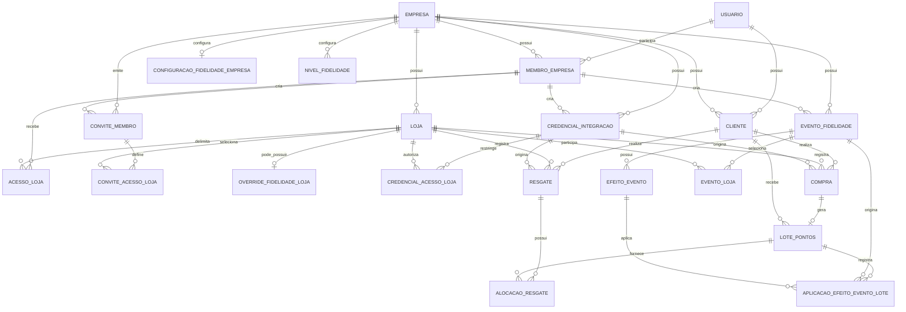

# Modelagem de Dados — Retorna

## 1. Objetivo

Este documento descreve a modelagem de dados vigente da Retorna após a conclusão da F3.05 e da F4.01.

O objetivo é explicar **o que cada entidade representa, como as entidades se relacionam e quais invariantes o domínio preserva**. Este arquivo não substitui `models.py`, migrations ou services: o código e o histórico de migrations continuam sendo a fonte de verdade operacional.

`docs/SEED_FATECALCADOS.md` permanece responsável pelo cenário fictício de demonstração. Aqui o foco é o modelo geral do produto.

## 2. Convenções da modelagem

### 2.1 Empresa é o tenant principal

A separação multiempresa parte de `Empresa`. Entidades corporativas ou fatos de fidelidade se relacionam direta ou indiretamente a uma Empresa.

A modelagem evita tratar Loja como tenant independente. Uma Empresa possui `1..N` Lojas e pode aplicar políticas corporativas ou, quando permitido, overrides por Loja.

### 2.2 Identidade global é separada do vínculo de domínio

`Usuario` é a identidade autenticável global, identificada por CPF.

Um mesmo `Usuario` pode possuir:

- vínculo `Cliente` em uma ou mais Empresas;
- vínculo `MembroEmpresa` em uma ou mais Empresas.

Assim, CPF não identifica um Cliente global da plataforma. O Cliente é o vínculo `Usuario + Empresa`.

### 2.3 Papel e escopo são conceitos diferentes

`MembroEmpresa.papel` define **o que** o membro pode fazer.

`AcessoLoja` define **onde** um Gestor pode atuar.

O Administrador possui escopo corporativo implícito. O Gestor possui escopo explícito pelas Lojas relacionadas em `AcessoLoja`.

### 2.4 Histórico não é reescrito

Compra, concessão de pontos, aplicação de campanha e Resgate preservam os fatos e snapshots utilizados quando a operação foi processada.

Alterar a configuração atual da Empresa não reescreve fatos históricos já persistidos.

### 2.5 `PROTECT` é a regra predominante nas relações críticas

Relações principais usam `on_delete=PROTECT` para impedir que exclusões removam silenciosamente dados dependentes ou históricos.

Algumas entidades históricas possuem proteções adicionais contra edição e exclusão pelos caminhos normais do domínio.

### 2.6 Valores financeiros e pontos usam `Decimal`

Valores monetários, taxas, multiplicadores e pontuação não usam `float` como representação de domínio.

`LotePontos` e alocações de Resgate possuem precisão física de quatro casas decimais para pontos.

## 3. Visão geral

| Entidade | Responsabilidade principal | Escopo | Natureza |
| --- | --- | --- | --- |
| `Usuario` | identidade autenticável por CPF | global | identidade |
| `Empresa` | tenant principal | global | estrutural |
| `Loja` | unidade pertencente à Empresa | Empresa | estrutural |
| `Cliente` | vínculo de um Usuario com uma Empresa | Empresa | vínculo |
| `MembroEmpresa` | vínculo administrativo de Usuario com Empresa | Empresa | vínculo |
| `AcessoLoja` | escopo explícito de Loja para Gestor | Empresa | vínculo |
| `ConviteMembro` | convite administrativo direcionado por CPF | Empresa | processo |
| `ConviteAcessoLoja` | Lojas selecionadas para convite de Gestor | Empresa | processo |
| `ConfiguracaoFidelidadeEmpresa` | política corporativa de fidelidade | Empresa | configuração |
| `OverrideFidelidadeLoja` | override permitido por Loja | Loja | configuração |
| `CredencialIntegracao` | identidade técnica de integração | Empresa | segurança/integração |
| `CredencialAcessoLoja` | Lojas emitidas para credencial com escopo `LOJAS` | Empresa | segurança/integração |
| `Compra` | fato histórico recebido da integração | Empresa via Loja | histórico |
| `LotePontos` | concessão histórica originada por Compra | Empresa via Cliente | histórico |
| `EventoFidelidade` | definição de campanha temporária | Empresa | configuração histórica |
| `EfeitoEvento` | efeito pertencente ao Evento | Empresa via Evento | configuração histórica |
| `EventoLoja` | Lojas explícitas de Evento com escopo `LOJAS` | Empresa | configuração histórica |
| `AplicacaoEfeitoEventoLote` | proveniência do efeito aplicado a um Lote | Empresa | histórico |
| `Resgate` | fato histórico de consumo de pontos | Empresa via Loja | histórico |
| `AlocacaoResgate` | parcela de um Lote consumida por Resgate | Empresa | histórico |
| `NivelFidelidade` | faixa configurável de classificação | Empresa | configuração |

## 4. Diagrama entidade-relacionamento

O diagrama abaixo mostra as relações principais. Ele é uma visão de domínio e não tenta reproduzir cada campo técnico do banco.



## 5. Identidade, Empresa e Cliente

### 5.1 `Usuario`

`Usuario` estende `AbstractUser`, remove `username` e utiliza `cpf` como `USERNAME_FIELD`.

Características relevantes:

- CPF com 11 dígitos normalizados e validação própria;
- CPF único globalmente;
- autenticação baseada em CPF + senha;
- a identidade não determina sozinha em qual Empresa a pessoa atua.

### 5.2 `Empresa`

`Empresa` representa o tenant principal.

Campos centrais:

- `nome`;
- `slug` único;
- `cnpj` único e validado;
- `criado_em`.

O `slug` é tratado como identidade estável pelos caminhos normais do domínio e não pode ser alterado depois da criação.

### 5.3 `Loja`

Cada `Loja` pertence a uma `Empresa` por FK protegida.

Campos centrais:

- `empresa`;
- `nome`;
- `cidade`.

A Empresa da Loja não pode ser trocada depois da criação pelos caminhos normais do domínio.

### 5.4 `Cliente`

`Cliente` representa a participação de um `Usuario` no programa de uma `Empresa`.

Relações:

```text
Usuario 1 ── N Cliente N ── 1 Empresa
```

Constraint principal:

```text
UNIQUE(usuario, empresa)
```

Consequências:

- o mesmo Usuario pode ser Cliente de Empresas diferentes;
- não podem existir dois vínculos de Cliente para o mesmo Usuario na mesma Empresa;
- a Empresa do vínculo não pode ser trocada depois da criação.

`Cliente` **não armazena** saldo, pontos acumulados, nível ou indicador de atividade.

## 6. Administração, papéis e escopo

### 6.1 `MembroEmpresa`

Representa um vínculo administrativo entre `Usuario` e `Empresa`.

Papéis implementados:

- `ADMINISTRADOR`;
- `GESTOR`.

Campos relevantes:

- `usuario`;
- `empresa`;
- `papel`;
- `ativo`.

Constraint:

```text
UNIQUE(usuario, empresa)
```

### 6.2 `AcessoLoja`

Relaciona um `MembroEmpresa` a uma `Loja`.

Seu uso principal é representar o escopo explícito do Gestor.

Constraint:

```text
UNIQUE(membro, loja)
```

A Loja precisa pertencer à mesma Empresa do membro.

### 6.3 Administrador x Gestor

A modelagem não cria registros de `AcessoLoja` para representar o escopo corporativo do Administrador.

Conceitualmente:

```text
ADMINISTRADOR
→ Empresa inteira
→ Lojas atuais e futuras

GESTOR
→ somente Lojas explicitamente relacionadas
```

## 7. Convites administrativos

### 7.1 `ConviteMembro`

Registra um convite direcionado por CPF para entrada administrativa em uma Empresa.

Dados relevantes:

- Empresa;
- CPF normalizado;
- papel proposto;
- `token_hash` único;
- membro criador;
- criação e expiração;
- timestamps de aceite e revogação.

O token bruto não é persistido. O estado do convite é derivado de aceite, revogação, expiração e hora atual.

### 7.2 `ConviteAcessoLoja`

Relaciona um convite de Gestor às Lojas que serão concedidas no aceite.

Constraint:

```text
UNIQUE(convite, loja)
```

Somente convite com papel `GESTOR` pode possuir Lojas individuais e cada Loja precisa pertencer à mesma Empresa do convite.

## 8. Configuração de fidelidade

### 8.1 Hierarquia

A resolução de configuração segue:

```text
Padrão do produto
↓
ConfiguracaoFidelidadeEmpresa
↓
OverrideFidelidadeLoja, quando permitido
```

### 8.2 `ConfiguracaoFidelidadeEmpresa`

Existe no máximo uma configuração corporativa por Empresa, por `OneToOneField`.

Parâmetros vigentes:

- `precisao_pontos`;
- `modo_arredondamento_pontos`;
- `pontos_por_real`;
- `validade_pontos_meses`;
- `resgate_minimo_pontos`;
- `incremento_resgate_pontos`;
- `valor_monetario_por_ponto`;
- `periodo_cliente_ativo_dias`.

A relação com Empresa é protegida e não pode ser movida para outro tenant depois da criação.

### 8.3 `OverrideFidelidadeLoja`

A fase atual permite override somente de:

- `pontos_por_real`.

A ausência de registro significa herança da Empresa. Um valor `0.00` é um override válido e não representa ausência.

A relação é `OneToOne` com Loja.

## 9. Credenciais de integração

### 9.1 `CredencialIntegracao`

Representa uma identidade técnica separada de `Usuario`.

Campos centrais:

- `empresa`;
- `nome`;
- `identificador` único;
- `segredo_hash`;
- `escopo`;
- `ativa`;
- `criada_por`;
- timestamps de criação e último uso.

Escopos disponíveis:

- `EMPRESA`;
- `LOJAS`.

A Empresa e o tipo de escopo são imutáveis depois da emissão pelos caminhos normais. Mudança de escopo exige desativar a credencial e criar outra.

### 9.2 `CredencialAcessoLoja`

Para credenciais de escopo `LOJAS`, registra o conjunto explícito de Lojas autorizado na emissão.

Constraint:

```text
UNIQUE(credencial, loja)
```

O conjunto emitido é tratado como imutável. Relações individuais só podem ser criadas durante o fluxo oficial de emissão da credencial.

## 10. Compra

### 10.1 `Compra`

Representa um fato histórico de venda recebido de uma integração externa.

Relações:

- `Loja`;
- `Cliente`;
- `CredencialIntegracao` de origem.

Campos de domínio centrais:

- `identificador_externo`;
- `valor` em `Decimal(12,2)`;
- `ocorrida_em` timezone-aware;
- `criada_em`.

Constraint idempotente:

```text
UNIQUE(loja, identificador_externo)
```

Também existe constraint para valor estritamente positivo.

Loja, Cliente e credencial precisam pertencer ao mesmo tenant e a credencial precisa estar autorizada para a Loja no momento da nova operação.

Os fatos materiais da Compra ficam imutáveis depois da criação.

## 11. Concessão de pontos

### 11.1 `LotePontos`

Representa a concessão histórica de pontos de uma Compra.

Relações:

```text
Compra 1 ── 1 LotePontos
Cliente 1 ── N LotePontos
```

Principais dados persistidos:

- `pontos_base`;
- `pontos_concedidos`;
- `pontos_por_real_aplicado`;
- `multiplicador_pontos_aplicado`;
- `precisao_pontos_aplicada`;
- `modo_arredondamento_aplicado`;
- `validade_pontos_meses_aplicada`;
- `adquiridos_em`;
- `expira_em`;
- `criado_em`.

Esses campos formam snapshots do cálculo realmente aplicado. Alterar a configuração atual não modifica o Lote existente.

Invariantes centrais:

- o Cliente do Lote é o mesmo da Compra;
- `adquiridos_em = Compra.ocorrida_em`;
- `expira_em` deriva da ocorrência + validade em meses de calendário;
- `pontos_base` e `pontos_concedidos` precisam corresponder aos snapshots persistidos;
- valores e datas históricas não podem ser reescritos pelos caminhos normais.

## 12. Eventos e campanhas

### 12.1 `EventoFidelidade`

Representa uma definição de campanha temporária da Empresa.

Campos centrais:

- `empresa`;
- `nome` e descrição;
- `inicio_em`;
- `fim_em`;
- `escopo`;
- `criado_por`;
- `criado_em`;
- `cancelado_em`.

Escopos:

- `EMPRESA`;
- `LOJAS`.

O período precisa possuir fim posterior ao início.

O estado não é persistido como coluna. Ele é derivado como:

- `AGENDADO`;
- `VIGENTE`;
- `ENCERRADO`;
- `CANCELADO`.

A definição é histórica: período, escopo, efeitos e conjunto de Lojas não são editados depois da criação. O cancelamento é uma transição explícita e também preservada.

### 12.2 `EfeitoEvento`

Representa um efeito pertencente ao Evento.

O único tipo operacional atual é:

```text
MULTIPLICADOR_PONTOS
```

O valor é `Decimal(12,4)` estritamente positivo.

Existe unicidade de `evento + tipo`.

### 12.3 `EventoLoja`

Utilizado quando `EventoFidelidade.escopo = LOJAS`.

Relaciona Evento e Loja e possui unicidade por par:

```text
UNIQUE(evento, loja)
```

A Loja precisa pertencer à Empresa do Evento.

### 12.4 `AplicacaoEfeitoEventoLote`

Registra a proveniência histórica de um efeito efetivamente aplicado a um Lote.

Relaciona:

- `LotePontos`;
- `EventoFidelidade`;
- `EfeitoEvento`.

Também preserva o tipo e o valor aplicados, para que o histórico não dependa de reavaliar a definição atual da campanha.

## 13. Resgate e consumo de Lotes

### 13.1 `Resgate`

Representa o fato histórico de Resgate solicitado por uma integração.

Relações:

- Loja;
- Cliente;
- credencial de origem.

Campos centrais:

- `identificador_externo`;
- `pontos_resgatados` em `Decimal(20,0)`;
- `resgate_minimo_pontos_aplicado`;
- `incremento_resgate_pontos_aplicado`;
- `valor_monetario_por_ponto_aplicado`;
- `valor_desconto` em `Decimal(32,2)`;
- `resgatado_em`.

Constraint idempotente:

```text
UNIQUE(loja, identificador_externo)
```

O Resgate preserva snapshots da política aplicada e não aceita backdating na API operacional.

### 13.2 `AlocacaoResgate`

Representa quanto de um `LotePontos` foi consumido por um Resgate.

Relações:

```text
Resgate 1 ── N AlocacaoResgate N ── 1 LotePontos
```

Campos principais:

- `resgate`;
- `lote`;
- `pontos_consumidos` em `Decimal(24,4)`.

Constraints principais:

```text
UNIQUE(resgate, lote)
pontos_consumidos > 0
```

O fluxo oficial seleciona Lotes por FEFO:

```text
expira_em ASC
→ adquiridos_em ASC
→ pk ASC
```

A alocação não reduz fisicamente `LotePontos.pontos_concedidos`; o consumo é representado pelo histórico de alocações.

## 14. Níveis

### 14.1 `NivelFidelidade`

Representa uma faixa configurável de uma Empresa.

Campos centrais:

- `empresa`;
- `nome`;
- `pontos_minimos` em `Decimal(24,4)`.

Ordenação:

```text
pontos_minimos ASC
```

Constraints principais:

```text
UNIQUE(empresa, pontos_minimos)
pontos_minimos >= 0
```

Uma configuração vazia é válida. Quando existem níveis, o service de escrita exige que o menor threshold seja exatamente `0.0000`.

Não existe FK `Cliente → NivelFidelidade`.

O nível atual é calculado a partir do histórico e da configuração vigente.

## 15. Dados persistidos x dados derivados

Esta separação é central para compreender a modelagem atual.

### 15.1 Saldo disponível

**Não existe coluna de saldo no Cliente.**

Conceitualmente, no instante `T`:

```text
saldo(T)
=
SUM(pontos_concedidos dos Lotes com expira_em > T)
-
SUM(pontos_consumidos das Alocacoes desses Lotes)
```

Um Lote com `expira_em == T` já está expirado para o Resgate.

### 15.2 Pontos para nível

Também não existe campo de pontos acumulados no Cliente.

A classificação utiliza:

```text
pontos_para_nivel
=
SUM(LotePontos.pontos_concedidos)
```

É uma soma histórica:

- inclui Lotes expirados;
- não subtrai Resgates;
- incorpora campanhas por meio dos pontos já concedidos e persistidos.

### 15.3 Nível atual

O nível atual é derivado de:

```text
pontos_para_nivel
+
thresholds atuais da Empresa
```

O maior threshold menor ou igual ao total define a faixa atual.

Como o nível não é materializado, alterar thresholds pode reclassificar o estado atual sem reescrever os fatos históricos.

### 15.4 Atividade do Cliente

Não existe campo `ativo` de fidelidade em `Cliente`.

A configuração corporativa possui `periodo_cliente_ativo_dias`, e a F4.01 preparou Compras recentes e antigas para permitir o cálculo posterior do indicador.

A definição operacional final do indicador de Clientes ativos pertence ao Dashboard da F4.02.

### 15.5 Estado do Evento

Também não existe coluna redundante de estado do Evento.

O estado é calculado a partir de:

- `cancelado_em`;
- `inicio_em`;
- `fim_em`;
- hora atual.

## 16. O que `Cliente` não possui

Para evitar interpretações incorretas da modelagem atual:

```text
Cliente
├── NÃO possui saldo materializado
├── NÃO possui pontos_acumulados materializados
├── NÃO possui nivel_id
└── NÃO possui status de atividade de fidelidade materializado
```

Essas informações são calculadas a partir dos fatos e configurações apropriados.

## 17. Fluxos principais de persistência

### 17.1 Nova Compra

```text
CredencialIntegracao
+
Loja
+
Cliente
+
fatos da venda
↓
Compra
↓
resolver configuração efetiva
↓
resolver Evento aplicável
↓
LotePontos
↓
AplicacaoEfeitoEventoLote, quando houver campanha
```

Compra e sua concessão são processadas atomicamente para novas operações vencedoras.

### 17.2 Novo Resgate

```text
CredencialIntegracao
+
Loja
+
Cliente
+
pontos solicitados
↓
Resgate
↓
seleção de Lotes válidos por FEFO
↓
AlocacaoResgate(s)
```

O saldo não é decrementado em um campo; o consumo passa a fazer parte da derivação por meio das alocações.

### 17.3 Classificação de nível

```text
Cliente
↓
SUM(LotePontos.pontos_concedidos)
↓
thresholds atuais de NivelFidelidade
↓
classificação atual
```

Resgate, expiração e inatividade não removem pontos da soma histórica de classificação.

## 18. Idempotência

### Compra

Chave:

```text
Loja + identificador_externo
```

### Resgate

Chave:

```text
Loja + identificador_externo
```

Retry equivalente preserva o fato original e seus snapshots; não recalcula a operação usando a configuração atual.

## 19. Concorrência e consistência

A modelagem é complementada por services transacionais e locks PostgreSQL.

Exemplos já implementados:

- constraint SQL para unicidade idempotente de Compra;
- `pg_advisory_xact_lock` para arbitrar a chave de Resgate antes do consumo;
- lock do Cliente e dos Lotes durante consumo FEFO;
- lock de Empresa para serializar escrita de Eventos, parâmetros e níveis;
- constraints SQL como defesa final para unicidades e valores inválidos.

Essas regras fazem parte do comportamento do domínio, mesmo quando não aparecem diretamente como coluna ou FK.

## 20. Imutabilidade e exclusão

O modelo diferencia entidades estruturais/configuráveis de fatos históricos.

Fatos históricos como Compra, Lote, aplicações de Evento, Resgate e alocações não devem ser tratados como CRUD comum.

A combinação de:

- `PROTECT`;
- validações de imutabilidade;
- guards de escrita dos services;
- bloqueios de exclusão;
- constraints SQL;

preserva a coerência do histórico pelos caminhos normais do produto.

Operações bulk, `QuerySet.update` e SQL bruto ficam fora do contrato normal quando não passam pelas invariantes dos services/models.

## 21. Relação com o seed FATECalçados

A F4.01 não introduziu entidades novas nem migrations.

O seed usa o modelo acima pelos fluxos reais para produzir um cenário de demonstração com:

- Empresa e Lojas;
- Clientes;
- configuração;
- níveis;
- Evento 2x;
- Compras;
- Lotes derivados;
- aplicações históricas;
- Resgates;
- alocações FEFO.

A composição concreta, personagens e resultados esperados pertencem a `docs/SEED_FATECALCADOS.md`.

## 22. Limitações e evoluções previstas

A modelagem atual deliberadamente ainda não inclui, entre outras evoluções:

- benefício automático por nível;
- bônus de pontos por nível;
- desconto automático por nível;
- cancelamento/estorno de Resgate;
- ledger genérico de pontos;
- API pública de saldo ou níveis;
- histórico materializado de progressão/rebaixamento de nível;
- classificação de nível por janela temporal;
- atividade materializada no Cliente;
- múltiplos efeitos combináveis de campanha;
- motor genérico de regras.

Essas capacidades não devem ser inferidas dos modelos atuais até que sejam implementadas e documentadas explicitamente.

## 23. Fonte de verdade

Em caso de divergência entre este documento e a implementação, prevalecem:

1. migrations aplicadas;
2. models vigentes;
3. services e contratos operacionais;
4. testes que formalizam as invariantes.

Este documento deve ser atualizado quando a modelagem mudar de forma relevante.